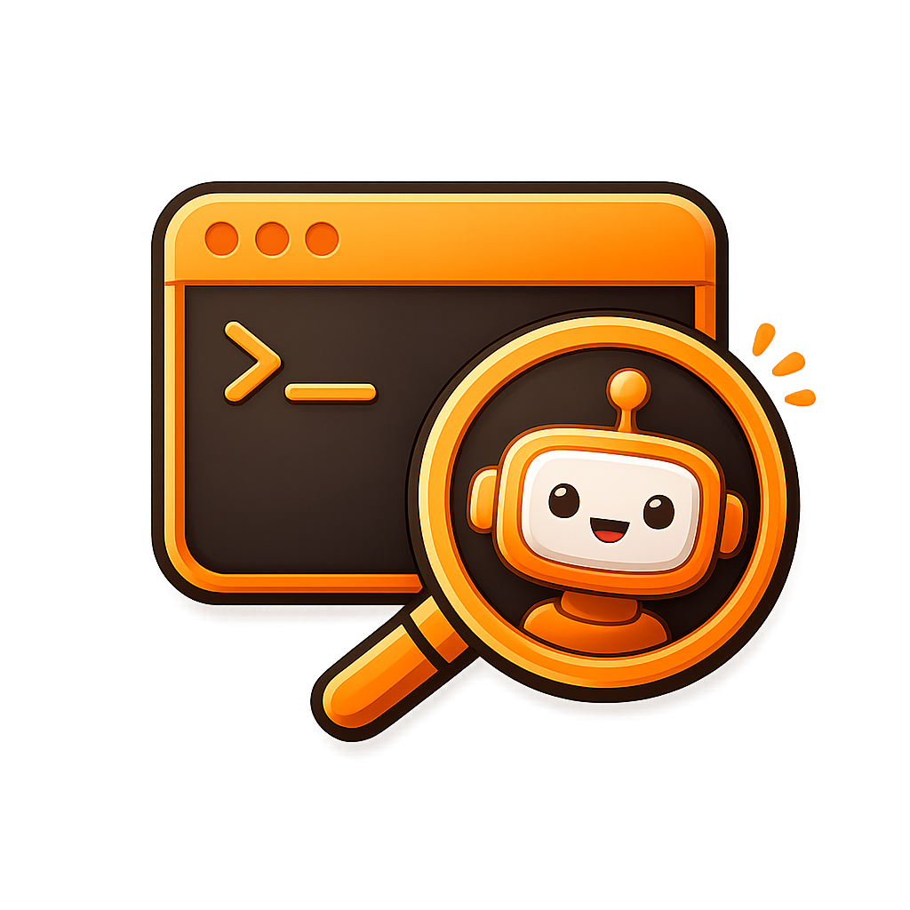

<p align="center">
  
</p>

# Claude Terminal Focus

**Focuses the correct VS Code terminal tab when clicking a Claude Code notification.**

When running multiple Claude Code sessions across different VS Code windows and terminals, this extension + notification hooks let you:

1. **Hear a sound** when Claude finishes a task or needs your input
2. **See a banner notification** showing which project needs attention
3. **Click the notification** to jump directly to the correct VS Code window and terminal tab

Works with multiple VS Code windows and multiple Claude terminals simultaneously on **macOS** and **Windows**.

## Installation

### 1. Install the VS Code Extension

From the VS Code Marketplace:
- Open VS Code → Extensions (Ctrl/Cmd+Shift+X) → Search **"Claude Terminal Focus"** → Install

Or via CLI:
```bash
code --install-extension dimokol.claude-terminal-focus
```

### 2. Set Up Notification Scripts

The extension needs notification hooks configured in Claude Code to write signal files and show notifications.

---

## macOS Setup

### Prerequisites

```bash
brew install terminal-notifier
```

Then: **System Settings → Notifications → terminal-notifier** → set alert style to **Alerts** (stays on screen until dismissed).

### Create notification scripts

Copy the scripts from this repo to your Claude config directory:

```bash
cp scripts/macos/notify.sh ~/.claude/notify.sh
cp scripts/macos/task-complete.sh ~/.claude/task-complete.sh
chmod +x ~/.claude/notify.sh ~/.claude/task-complete.sh
```

**Important**: Check the path to `code` CLI in both scripts. The default is `/usr/local/bin/code`. Verify with `which code` — on Apple Silicon it might be `/opt/homebrew/bin/code`. Update the scripts if needed.

### Configure Claude Code hooks

Add to `~/.claude/settings.json` (merge with existing content):

```json
{
  "hooks": {
    "Stop": [
      {
        "matcher": "",
        "hooks": [
          {
            "type": "command",
            "command": "bash $HOME/.claude/task-complete.sh"
          }
        ]
      }
    ],
    "Notification": [
      {
        "matcher": "",
        "hooks": [
          {
            "type": "command",
            "command": "bash $HOME/.claude/notify.sh"
          }
        ]
      }
    ]
  }
}
```

### Global gitignore

```bash
echo '.vscode/.claude-focus' >> ~/.gitignore_global
echo '.vscode/.claude-focus-clicked' >> ~/.gitignore_global
git config --global core.excludesfile ~/.gitignore_global
```

---

## Windows Setup

Windows uses PowerShell scripts with Windows Runtime Toast API for notifications.

### Create scripts

Copy the scripts from this repo to your Claude config directory:

```powershell
Copy-Item scripts/windows/write-signal.ps1 $env:USERPROFILE\.claude\write-signal.ps1
Copy-Item scripts/windows/notify.ps1 $env:USERPROFILE\.claude\notify.ps1
Copy-Item scripts/windows/task-complete.ps1 $env:USERPROFILE\.claude\task-complete.ps1
```

### Configure Claude Code hooks

Add to `%USERPROFILE%\.claude\settings.json`. **Replace `YOUR_USERNAME`** with your Windows username in all 4 places:

```json
{
  "hooks": {
    "Stop": [
      {
        "matcher": "",
        "hooks": [
          {
            "type": "command",
            "command": "mkdir -p \"$PWD/.vscode\" && cygpath -w \"$PWD\" > \"$HOME/.claude/notify-path\" && powershell -NoProfile -ExecutionPolicy Bypass -File C:/Users/YOUR_USERNAME/.claude/write-signal.ps1 && powershell -NoProfile -Command \"\\$ws = New-Object -ComObject WScript.Shell; \\$ws.Run('powershell.exe -NoProfile -WindowStyle Hidden -ExecutionPolicy Bypass -File C:\\Users\\YOUR_USERNAME\\.claude\\task-complete.ps1', 0, \\$false)\""
          }
        ]
      }
    ],
    "Notification": [
      {
        "matcher": "",
        "hooks": [
          {
            "type": "command",
            "command": "mkdir -p \"$PWD/.vscode\" && cygpath -w \"$PWD\" > \"$HOME/.claude/notify-path\" && powershell -NoProfile -ExecutionPolicy Bypass -File C:/Users/YOUR_USERNAME/.claude/write-signal.ps1 && powershell -NoProfile -Command \"\\$ws = New-Object -ComObject WScript.Shell; \\$ws.Run('powershell.exe -NoProfile -WindowStyle Hidden -ExecutionPolicy Bypass -File C:\\Users\\YOUR_USERNAME\\.claude\\notify.ps1', 0, \\$false)\""
          }
        ]
      }
    ]
  }
}
```

### Global gitignore

```bash
echo '.vscode/.claude-focus' >> ~/.gitignore_global
git config --global core.excludesfile ~/.gitignore_global
```

---

## How It Works

```
Claude needs input / finishes task
       │
       ▼
Hook fires (bash script)
       │
       ├── Writes .vscode/.claude-focus (ancestor PID chain)
       ├── Plays sound
       └── Shows notification banner with project name
                │
                ▼ (user clicks notification)
                │
                ├── [macOS] terminal-notifier creates .claude-focus-clicked
                │    + opens correct VS Code window via code CLI
                │    └── Extension polls, finds marker → reads PIDs → focuses terminal
                │
                └── [Windows] Toast opens vscode://file/<path>
                     └── Window focus event → extension reads PIDs → focuses terminal
```

## Platform Differences

| | macOS | Windows |
|---|---|---|
| **Notifications** | `terminal-notifier` (brew) | Windows Runtime Toast API |
| **Click detection** | `.claude-focus-clicked` marker file (polling) | `vscode://` URI triggers window focus event |
| **Multi-window** | `code '$WORKSPACE_ROOT'` opens correct window | `vscode://file/<path>` opens correct window |
| **PID chain** | `ps -o ppid=` | `Get-CimInstance Win32_Process` |
| **Sound** | `afplay *.aiff` | `SystemSounds.Asterisk.Play()` |

## Verify

1. Reload VS Code (Cmd/Ctrl+Shift+P → "Developer: Reload Window")
2. Open Output panel → select **"Claude Terminal Focus"** → should show "activated"
3. Open 2+ terminals, run Claude in one, work in another
4. When Claude needs input → sound + banner with project name
5. Click the banner → correct VS Code window + correct terminal tab

## Troubleshooting

| Problem | Solution |
|---------|----------|
| No sound | macOS: check `afplay`. Windows: check system volume |
| No banner | macOS: System Settings → Notifications → terminal-notifier. Windows: Settings → Notifications |
| Extension not activating | Output panel → "Claude Terminal Focus" dropdown. If missing, reinstall |
| Wrong terminal focused | Check Output panel PID matching logs |
| macOS: wrong VS Code window | Check `which code` and update path in scripts |
| macOS: notification disappears fast | Set terminal-notifier to "Alerts" in System Settings |
| Windows: toast doesn't open VS Code | Run VS Code once to register the `vscode://` URL handler |

## Customizing Sounds

**macOS**: Edit `notify.sh` / `task-complete.sh` and change the `afplay` path. Available sounds: `/System/Library/Sounds/*.aiff`

**Windows**: Edit `notify.ps1` / `task-complete.ps1` and change `SystemSounds` call. Options: `Asterisk`, `Beep`, `Exclamation`, `Hand`, `Question`

## License

MIT
