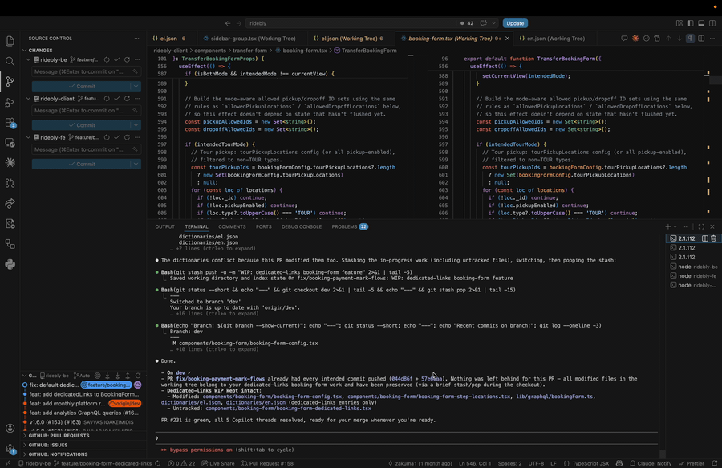
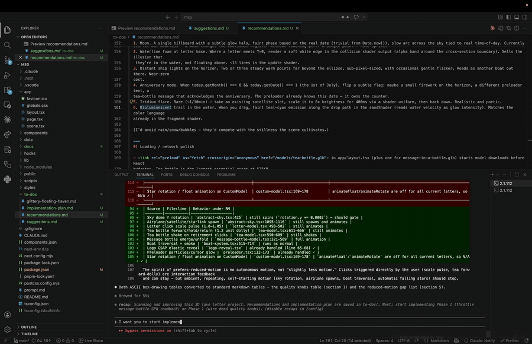

# Claude Notifications

**All-in-one Claude Code notification system: sound alerts, OS banners, and terminal focus. Zero-interaction setup, fully customizable.**





When running multiple Claude Code sessions across different VS Code windows and terminals:

1. **Hear a sound** when Claude finishes a task or needs your input.
2. **See an OS banner** showing which project needs attention, even when VS Code is not in focus.
3. **Click the banner** to jump directly to the correct VS Code window and terminal tab.

Works on **macOS**, **Windows**, and **Linux**, across multiple VS Code windows and terminals simultaneously.

## Quick Start

1. **Install** from the VS Code Marketplace:
   - Extensions (`Ctrl/Cmd+Shift+X`) → search **"Claude Notifications"** → Install.

2. **That's it.** Hooks are installed automatically on first activation, no prompts, no clicks. You'll see a confirmation toast and the status bar shows `$(bell) Claude: Notify`.

3. **Restart any `claude` session that was already running.** Claude Code reads its hook config once at startup, so sessions started before the install won't fire notifications until restarted.

   If you ever need to re-run setup: `Ctrl/Cmd+Shift+P` → **"Claude Notifications: Set Up Claude Code Hooks"**.

## What's New in v3.6.0

A reliability release focused on the "never zero, never two" notification guarantee.

- **Fixed a window where notifications vanished entirely.** A new question or completion landing 3 to 5 seconds after the previous notification was silently dropped by the claim layer (the dedup approved it, the claim marker suppressed it). Answer a question fast and the next one could arrive mute. Claim markers now carry the attention point's identity, so a genuinely new event always gets through.
- **Questions notify even if Claude Code changes its events.** Multi-choice `AskUserQuestion` prompts used to depend entirely on the `PermissionRequest` hook, which upstream doesn't guarantee for questions. A second, documented channel (`PreToolUse` scoped to `AskUserQuestion`) now announces every question redundantly; the dedup collapses the pair, so still exactly one alert.
- **Banners show the actual question.** `Question in api-server: Which auth method should we use?` instead of a generic "Waiting for your response".
- **Your terminal names in notifications.** Renamed a terminal tab to `deploy-bot`? Banners and toasts for that session now say `deploy-bot` instead of the AI-generated session title. No setup needed: rename the tab and the next notification picks it up.
- **Extension updates can no longer kill your hooks mid-session.** If a Claude hook fired while VS Code was swapping extension versions, the wrapper mistook the update for an uninstall and stripped every profile's hooks. It now re-points itself at the newest installed version and only self-destructs on a true uninstall.
- **Smarter handling of Claude Code's notification types.** Status-only events (`auth_success`, elicitation results) no longer fire bogus "waiting" banners; background-agent events (`agent_needs_input` / `agent_completed`, Claude Code ≥2.1.198) now notify properly instead of being suppressed as re-fires.
- **macOS fixes:** `terminal-notifier` is found even when VS Code was launched from the Dock (Homebrew not on PATH); alerts remain clickable for 1 hour instead of 5 minutes; apostrophes in session titles no longer break the fallback banner.
- **Housekeeping:** stale per-workspace state dirs are garbage-collected after 30 days, `Test Notification` works without `node` on PATH, and torn signal-file reads can't fire garbage notifications anymore.

> **Heads-up for Claude Code 2.1.198 and 2.1.199 (Jul 1 and 2, 2026):** those builds auto-answered multi-choice questions after 60 seconds of idle by default (reverted to opt-in in 2.1.200). If questions seemed to "answer themselves" or notifications seemed missed while away, update Claude Code to 2.1.200 or newer; that was upstream, not the notifications.

See [CHANGELOG.md](CHANGELOG.md) for the full history, including the v3.5.5 Windows reliability overhaul.

## How It Works

```
Claude fires hook (Stop / Notification / PermissionRequest / PreToolUse[AskUserQuestion] / UserPromptSubmit)
       │
       ▼
hook.js consults stage-dedup state for this session
       │
       ├─ Re-fire of an already-notified, unresolved stage → exit silently
       │
       └─ Fresh stage (first event for the session, or previous stage acked):
             │
             ▼
       Write signal file → sleep 1.2 s → race the extension
             │
             ├── Extension wins the claim (VS Code is focused):
             │     ├─ Already on the correct terminal → sound only (and ack)
             │     └─ Different terminal / tab        → sound + in-window toast
             │
             └── Hook wins the claim (VS Code not focused / closed):
                   └─ OS banner + sound; clicking it focuses the terminal (and ack)
```

**Key design.** Exactly one notification path fires per stage: never zero, never two for the same stage. Both sides claim the same marker file atomically via `O_EXCL`, so the winner is unambiguous even under rapid concurrent events. A stage advances only when you've engaged (clicked, focused, responded) or Claude moves to a genuinely new state, so re-fires of the same event minutes later are silently dropped.

## Focus Behavior

The extension **never changes terminal focus without an explicit user action**:

- Clicking **"Focus Terminal"** on an in-window toast.
- Clicking an **OS banner** (focuses VS Code and auto-focuses the matching terminal, no extra toast).

You will never lose your place in a terminal because of a notification.

> **Windows note: clicking the banner flashes the taskbar instead of raising the window.** On Windows, clicking an OS banner reliably **switches to the correct terminal in the correct window**, but it currently can't pull the VS Code **window** itself to the front over another app. Windows flashes the taskbar button and you click it to come up (already on the right terminal). This is the same behavior as Slack/Discord/Teams toast clicks.

## Help wanted: Windows banner-click window focus

I spent a long, instrumented session trying to make a Windows banner click bring the VS Code window to the foreground, and could not do it reliably. The blocker is `ShellExperienceHost` (the toast surface) owning the foreground at click time, which Windows shields. Every approach I tried (`SetForegroundWindow`, `AttachThreadInput`, `SendInput`/Alt-key, `SwitchToThisWindow`, a shell-launched handler with the activation grant, `ForegroundLockTimeout=0`, even VS Code's own `vscode://file/` core activation) reduced to a taskbar flash on a real click. It matches a [documented Microsoft limitation](https://learn.microsoft.com/en-us/windows/apps/design/shell/tiles-and-notifications/toast-desktop-apps) and open issues ([microsoft-ui-xaml #1939](https://github.com/microsoft/microsoft-ui-xaml/issues/1939), [#5499](https://github.com/microsoft/microsoft-ui-xaml/issues/5499)); Electron/Chromium hit the same wall.

**If you know how to make this work on a current Windows + VS Code (e.g. a working COM activator / `INotificationActivationCallback` approach for an unpackaged app, or anything that beats the `ShellExperienceHost` foreground guard), I'd love a PR or an issue.** The full investigation (everything tried, why each failed, the proven facts, and how to approach the next attempt) is documented in [`docs/windows-banner-focus-handoff.md`](docs/windows-banner-focus-handoff.md). The focus-raising code itself (`lib/win-focus.js`) is proven correct *outside* the toast-click path; the open problem is narrowly the banner-click activation context.

## Status Bar

The extension adds a status bar item with three states:

- `$(gear) Claude: Set Up` - hooks not installed (click to install).
- `$(bell) Claude: Notify` - notifications active (click to mute).
- `$(bell-slash) Claude: Muted` - notifications muted (click to unmute).

When muted, signal files are still written (so terminal focus still works if you click the banner) but no sound or notification is shown.

## Settings

Settings are grouped per event so you can configure Waiting and Completed independently. All settings are prefixed with `claudeNotifications.`, e.g. `claudeNotifications.volume`.

### Top

| Setting | Default | Description |
|---|---|---|
| `autoSetupHooks` | `true` | Install and upgrade Claude Code hooks automatically. Uncheck to be prompted before any change to `~/.claude/settings.json`. |
| `volume` | `50` | `0` = silent, `50` ≈ typical OS notification, `100` = the sound file's native level. OS master volume still applies. |

### Waiting

Fires when Claude is waiting for your response (Notification + PermissionRequest).

| Setting | Default | Description |
|---|---|---|
| `waiting.action` | `Sound + Notification` | One of `Sound + Notification` · `Sound only` · `Notification only` · `Nothing`. |
| `waiting.sound` | `bundled:notification` | Dropdown of cross-platform values (`none`, two bundled chimes, `custom`). For every sound on your actual OS, use the **Choose Sound…** command. |
| `waiting.customSoundPath` | *(empty)* | Absolute path to a custom audio file. Used only when `waiting.sound` is `custom`. |

### Completed

Fires when Claude finishes a task (Stop).

| Setting | Default | Description |
|---|---|---|
| `completed.action` | `Sound + Notification` | Same options as `waiting.action`. |
| `completed.sound` | `bundled:task-complete` | Same options as `waiting.sound`. |
| `completed.customSoundPath` | *(empty)* | Absolute path to a custom audio file. Used only when `completed.sound` is `custom`. |

### Bottom

| Setting | Default | Description |
|---|---|---|
| `soundWhenFocused` | `sound` | What to do when you're already on the terminal Claude just wrote to: `sound` (play audio cue) or `nothing` (stay silent). |
| `macOS.setup` | n/a | macOS only. Link to the Configure command that detects whether `terminal-notifier` is installed and offers install / reinstall / test / open Notification Settings. |

#### Picking a system sound

The Settings-UI dropdown only lists cross-platform values because VS Code settings schemas can't be populated at runtime. Every sound actually available on your OS (macOS `/System/Library/Sounds`, Windows `C:\Windows\Media`, Linux freedesktop theme) lives in the **Choose Sound…** command:

1. From a **Waiting Sound** or **Completed Sound** row in Settings, click the **Choose Sound…** link. The picker opens pre-targeted at that event. From the command palette, invoke **"Claude Notifications: Choose Sound"** and pick the event first.
2. Click the **🔊 speaker icon** on any row to hear it at your configured volume. Playback is strictly opt-in: arrow-keying through the list doesn't play anything. The current selection is marked with a `✓`.
3. Highlight the one you want and press Enter to save, or Escape to cancel.

Picking a system sound writes `system:<Name>` to the setting. The Settings UI accepts the value and the extension resolves it at runtime.

#### Previewing your configured sounds

**"Claude Notifications: Preview Sound"** shows exactly two rows (Waiting and Completed), each with the current sound name and a speaker button. Click a speaker (or highlight + Enter) to hear that notification at your configured volume. Use this to check what your notifications will actually sound like.

## Commands

Open the command palette (`Ctrl/Cmd+Shift+P`) and search for:

| Command | Description |
|---|---|
| **Set Up Claude Code Hooks** | Install hooks in `~/.claude/settings.json`. |
| **Remove Claude Code Hooks** | Remove hooks (leaves any other settings untouched). |
| **Test Notification** | Send a test notification to verify your setup end-to-end. |
| **Toggle Mute** | Mute/unmute notifications (also available via the status bar). |
| **Choose Sound** | Browse bundled, system, and custom sounds per event. |
| **Preview Sound** | Listen to any available sound without changing settings. |
| **Configure macOS terminal-notifier** | Install / reinstall / test / open macOS Notification Settings. |

## Monitored Events

The extension listens to four Claude Code hook events, grouped into two types:

| Type | Hook events | Banner text | Bundled sound |
|---|---|---|---|
| **Waiting** | `Notification`, `PermissionRequest`, `PreToolUse` (scoped to `AskUserQuestion` only) | "Waiting for your response in: *{project}*", or "Question in *{project}*: *{question}*" for multi-choice questions | `notification.wav` |
| **Completed** | `Stop` | "Task completed in: *{project}*" | `task-complete.wav` |
| *(stage advance)* | `UserPromptSubmit` | none (bumps stageId so the next event re-notifies) | n/a |

`Notification` events are filtered by their `notification_type`: status-only types (`auth_success`, elicitation results) are ignored, background-agent types (`agent_needs_input` / `agent_completed`) notify as their own attention points, and the generic `permission_prompt` / `idle_prompt` reminders are collapsed into the primary event that already notified.

### Custom terminal names

Rename a terminal tab (right-click the tab → **Rename**, or `Terminal: Rename` in the command palette) and notifications for the Claude session in that terminal use your name as the identity line instead of the AI-generated session title, on OS banners and in-window toasts alike. Stock shell names and Claude's own titles don't count as custom, so nothing changes until you actually rename. If the name can't be resolved (for example Windows + Git Bash, where the shell PID is masked), notifications fall back to the AI title.

## macOS Setup

For the best click-to-open experience on macOS, install `terminal-notifier`. The extension prompts you on first activation **only if it's missing**, or you can run it anytime:

`Ctrl/Cmd+Shift+P` → **"Claude Notifications: Configure macOS terminal-notifier"**

The command detects whether `terminal-notifier` is already installed and offers the right action: install (via Homebrew), reinstall, send a test banner, or open System Settings → Notifications. The same entry is available under **Settings → Claude Notifications → macOS: Setup**.

After installing: **System Settings → Notifications → terminal-notifier** → set to **Alerts** (banners disappear after a few seconds; alerts stay until dismissed).

> **About duplicate `terminal-notifier` entries in System Settings.** If you see two `terminal-notifier` rows, macOS is remembering registrations from past installs (e.g. an older brew version, or one bundled with `node-notifier` inside some `node_modules`). Keep the entry configured the way you want and leave the other off. This extension only talks to the `terminal-notifier` on your `PATH`. It never registers a second copy.

Without `terminal-notifier`, the extension falls back to `osascript` notifications (which work but don't support click-to-open).

## Upgrading from v1.x

If you previously used the shell-script setup:

1. The extension detects legacy hooks and offers to upgrade automatically.
2. Choosing **"Replace"** removes the old shell hooks and installs the new Node.js hook.
3. You can safely delete the old scripts (`~/.claude/notify.sh`, `~/.claude/task-complete.sh`, etc.).

## Troubleshooting

| Problem | Solution |
|---|---|
| No notifications at all | Run **"Test Notification"** from the command palette. Check the status bar isn't showing `Muted`. |
| No sound | Check that `waiting.action` / `completed.action` aren't set to `Notification only` or `Nothing`, and that `volume` is > 0. |
| Sound is too loud or too quiet | Adjust `volume`. `50` matches typical OS-notification loudness; `100` plays the file at its native level. OS master volume still applies. |
| Notification doesn't open VS Code | macOS: run **"Configure macOS terminal-notifier"**. Windows: the toast click routes through a `vscode://dimokol.claude-notifications/…` URI to the extension's URI handler. On the first click VS Code asks "an external application wants to open"; choose **Open** and tick "Do not ask again for this extension". If clicks do nothing after that, check the **"Claude Notifications"** Output panel for `Click-to-focus [uri]` lines. |
| Want to fully uninstall | Just uninstall the extension from the VS Code Extensions view. The next Claude message after uninstall auto-cleans every artefact: hook entries from every Claude profile's `settings.json`, the per-workspace state in `~/.claude/focus-state/`, the wrapper dir at `~/.claude/claude-notifications/`, and (on Windows) the `claude-notif://` registry key plus the launcher in `%LOCALAPPDATA%\claude-notifications\`. The **"Claude Notifications: Uninstall"** palette command does the same thing eagerly if you want everything gone immediately. |
| Duplicate notifications | Update to v3.2+. The new stage-ID dedup suppresses re-fires of the same event until you acknowledge. See [How It Works](#how-it-works). If still duplicating, make sure the legacy `dimokol.claude-terminal-focus` extension is uninstalled. |
| Notifications stop firing | Inspect `~/.claude/focus-state/<hash>/sessions` (where `<hash>` is the 12-char hash for your workspace). If you see `resolved:true` stuck for the active session, that's the dedup remembering you acknowledged a stage. Delete the file to reset; the next event will create a fresh stage. |
| Two `terminal-notifier` entries in macOS Notifications | macOS keeps notification settings per bundle, and a past install (e.g. bundled with `node-notifier` or an older brew version) can linger. Configure the entry you want and leave the other off. To fully reset: `killall NotificationCenter` then fire any notification once to re-register. |
| Wrong terminal focused | Check the **"Claude Notifications"** Output panel for PID matching logs. |
| Hooks not firing | Run **"Set Up Claude Code Hooks"** and restart any active Claude Code sessions so they re-read `~/.claude/settings.json`. |
| Multi-choice questions answer themselves / seem to skip notification | Claude Code 2.1.198 and 2.1.199 auto-answered `AskUserQuestion` after 60s idle by default (opt-in since 2.1.200). Update Claude Code. |
| Extension not activating | Check the **"Claude Notifications"** channel in the Output panel. |

## How the Hook Works

The extension ships two bundled hooks that Claude Code invokes:

- `dist/hook.js`: runs on `Stop`, `Notification`, `PermissionRequest`, and `PreToolUse` (matcher-scoped to `AskUserQuestion`). Decides whether to notify, writes the signal, and races the extension for the claim.
- `dist/hook-user-prompt.js`: runs on `UserPromptSubmit`. Tiny: it just advances the session's `stageId` so the next Stop/Notification is treated as a fresh stage.

`hook.js` flow:

1. Reads `session_id`, `hook_event_name`, and `message` from stdin (Claude's hook input).
2. Reads the project directory from `CLAUDE_PROJECT_DIR` and walks up looking for a `.vscode/` folder to identify the VS Code workspace root.
3. Hashes that workspace root (`sha1` → 12 hex chars) to derive `~/.claude/focus-state/<hash>/`.
4. Calls `shouldNotify(workspaceRoot, sessionId, event)`; if the current stage was already notified for this event type and not yet acknowledged, exits immediately.
5. Builds a PID ancestor chain so the extension can focus the exact terminal tab that spawned Claude.
6. Writes a JSON signal file to `~/.claude/focus-state/<hash>/signal`.
7. Sleeps 1.2 seconds to give the extension time to claim if VS Code is focused.
8. Atomically tries to claim the handled-marker (`O_EXCL`). If the extension or a sibling hook already claimed it, exits silently.
9. Otherwise marks the signal `fired`, plays the configured sound, and shows an OS banner.

A stage is marked **resolved** only on an explicit click:

- You click an OS banner (`terminal-notifier -execute` writes a clicked marker; the extension picks it up and marks resolved).
- You click **Focus Terminal** on an in-window toast.

The sound-only path (notification fires while you're already on the matching terminal) deliberately does **not** resolve the stage, because doing so re-opened the dedup gate and double-sounded the trailing platform event (fixed in v3.3.1).

After a resolve, the next *primary* event (a `Stop`, `PermissionRequest`, or question `PreToolUse` arriving after the burst window) starts a fresh stage and notifies again; bare `Notification` re-fires stay collapsed.

`hook.js`, `hook-user-prompt.js`, and the extension are all bundled with esbuild, so the installed package has no runtime `node_modules` dependency, just self-contained JS files.

## License

MIT
